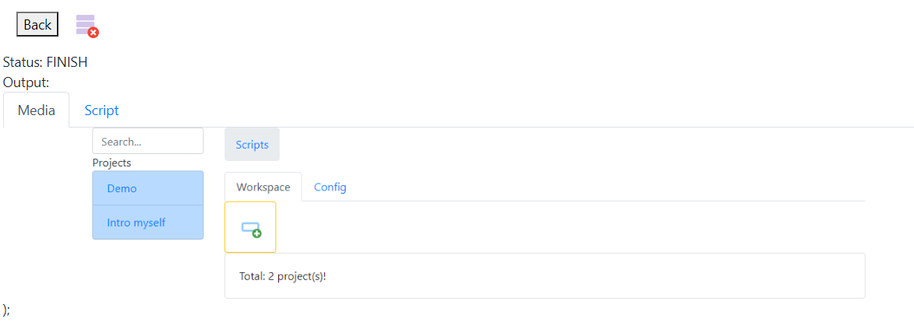

# AutoWeb
`AutoWeb` is a web app (based on Ktor, ReactJS, Bootstrap) which is used for:
- Manage `AutoAction` scripts
- Execute `AutoAction` scripts

:tv: [Tour about me](https://youtu.be/4oo4ukb9tLk)

# Start the AutoWeb server
- go to `bin`
- run `start.bat`

The default working url is `http://localhost:8080`.
:warning: Please refer to [Ktor config](https://ktor.io/docs/configurations.html) to config value, e.g `running port`, ...

# Run the first script
- Open homepage `http://localhost:8080`
- Click `Demo` project
- Click `Open Google` task
- Click the green Camera icon to run the task: system would launch Chrome browser and open Google page

Please run other tasks in `Demo` and `Intro myself` and refer to [AutoAction syntax](https://github.com/vochithanh/autoaction#autoaction-syntax) to know how to write the scripts.